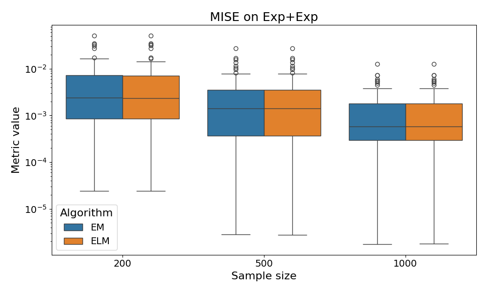

# EM-algo-experiment

This project aims to evaluate and compare the performance of the Expectation-Maximization (EM) algorithm against Expectation L-moments algorithm (ELM) for parameter estimation in various mixture models. 
The evaluation focuses on the Mean Integrated Squared Error (MISE) metric and computational performance (execution time) across different underlying mixture distributions and sample sizes.

## Project Structure

*   `boxplots/`: Stores the final visualization comparing algorithm performance (MISE) for different mixture types and sample sizes.
*   `experiment_XXX/`: Contains all data and results related to experiments run with a specific sample size (`XXX` being 200, 500, or 1000). Each experiment is broken down into stages.

## Workflow Stages

For each combination of mixture type (e.g., Exponential+Exponential, Gaussian+Gaussian) and sample size (200, 500, 1000), the experiment follows three main stages:

1.  **Stage 1: Sample Generation** (Output in `stage_1/`)
    *   Generates synthetic datasets (samples) from the specified initial mixture model.
    *   Saves the generated samples, typically within the corresponding mixture type subfolder (e.g., `experiment_200/stage_1/Exponential_Exponential/`).

2.  **Stage 2: Parameter Estimation** (Output in `stage_2/`)
    *   Applies the implemented parameter estimation algorithms (EM and ELM) to the samples generated in Stage 1.
    *   Saves the estimated parameters or model fits.

3.  **Stage 3: Analysis & Evaluation** (Output in `stage_3/`)
    *   Analyzes the results from Stage 2.
    *   Calculates Mean Integrated Squared Error (MISE) comparing the estimated density to the true ones.
    Based on the metric, it stores statistics such as mean, median, and standard deviation.
    *   Measures and records the execution time (speed) of each algorithm during the estimation phase.

## Results Visualization

The `boxplots/` directory contains summary plots visualizing the key findings. An example plot (`boxplot_Exponential_Exponential.png`) might look like this:

These plots typically show:
*   The distribution of MISE values obtained over multiple runs for both EM and ELM algorithms.
*   Comparison across different sample sizes (200, 500, 1000) on the x-axis.
*   The MISE metric on a logarithmic y-axis.
*   The specific mixture model under consideration (e.g., "Exp+Exp" in the title).